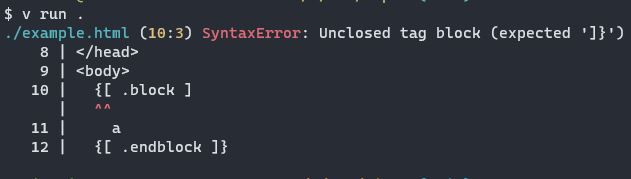

# Viper
## A tiny template engine for v

It's pronounced like the french word `vipère` [/vi.pɛʁ/](https://upload.wikimedia.org/wikipedia/commons/transcoded/6/6f/LL-Q150_%28fra%29-LoquaxFR-vip%C3%A8re.wav/LL-Q150_%28fra%29-LoquaxFR-vip%C3%A8re.wav.ogg)

## Installation

```bash
v install --git https://github.com/hanako-eo/viper.git
```

## Usage

In main.v:
```v
module main

import viper

fn main() {
	mut engine := viper.new()
	engine.add_tag(
		name: "block",
		handle: fn(_args string, value string) string {
			return value
		}
	)
	println(
		engine.render("./example.html", map[string]string{}) // If in example.html you have error, it will be shown and exit.
	)
}
```

In example.html:
```html
<!DOCTYPE html>
<html lang="en">
<head>
  <title>Viper Example</title>
</head>
<body>
  {[ block ]}
    a
  {[ endblock ]}
</body>
</html>
```

### Example of possible error


## License
See the [LICENSE](LICENSE) file
